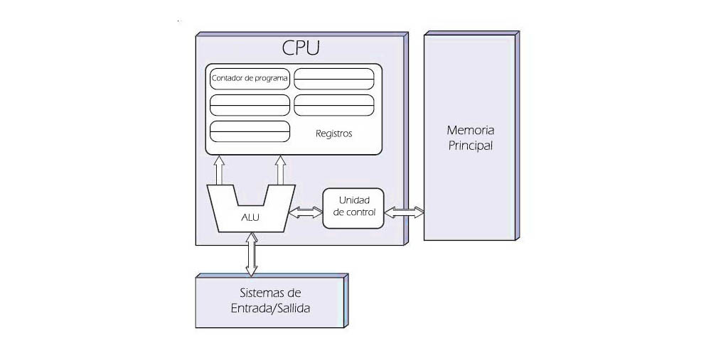
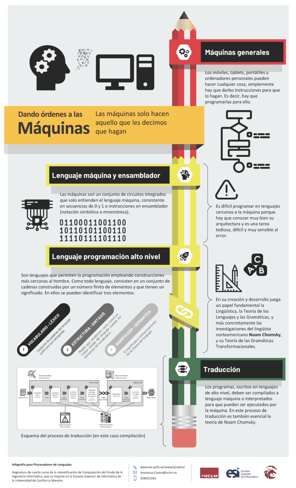

<div align="center">
  <h1> Introducción a la Computación Científica (ICC)</h1>

  <sub>Autor:
<a href="https://www.esi.uclm.es/www/jjcastro/" target="_blank">J.J. Castro-Schez</a><br>
<small> Primera edición: febrero de 2026</small>
</sub>

  <a class="header-badge" target="_blank" href="https://jjcastroschez.github.io">
  
  </a>

</div>

# Teoría - Tema 1: Introducción 🎓 

¡Bienvenido! Después de este primer tema, dejarás de ver el ordenador como una simple herramienta de oficina o entretenimiento para entenderlo como una **máquina universal** que podrás moldear, a través del uso de lenguajes de programación, para resolver problemas, incluidos los problemas matemáticos complejos.

---

## 🏛️ Sección 1: Programación

Los computadores son máquinas “universales” que pueden resolver cualquier **problema “computable”**. Es decir, problemas para los cuales existe un algoritmo (un conjunto finito de instrucciones) que permite encontrar una solución correcta en un número finito de pasos y empleando un número finito de recursos.

Para que un computador resuelva un problema concreto, hay que *“especializarlo”*. Esta especialización implica **programarlo** para que ejecute las tareas deseadas.

La programación consiste en **comunicar a la máquina las instrucciones** que queremos que ejecute (los programas). Este acto de comunicación, como cualquier otro, requiere del uso de un **lenguaje**.

El computador, a nivel físico, solo entiende el **lenguaje máquina** (sucesiones de ceros y unos que cumplen determinadas reglas). Puesto que para un ser humano es difícil e ineficiente comunicarse así, utilizamos los **lenguajes de programación de alto nivel**.

### 🏷️ Componentes de un computador
Básicamente, un computador es una máquina electrónica programable diseñada para procesar datos de forma automática. Su función principal es recibir información bruta, transformarla mediante operaciones lógicas y matemáticas, y entregar un resultado útil. Es, en esencia, un sistema capaz de seguir instrucciones (software) utilizando componentes físicos (hardware).

Según la arquitectura **John von Neumann**, los componentes hardware fundamentales son:

* **Unidad Aritmético Lógica** (**ALU**, *Arithmetic and Logic Unit*): funciona como una calculadora con capacidad para operar con datos, tomar decisiones lógicas y producir nuevos resultados. La ALU es el 💪 “músculo” de procesamiento.  
* **Unidad de Control** (**CU**, *Control Unit*): se encarga de interpretar las instrucciones de los programas y coordinar a los demás componentes (como la ALU o la memoria) para que todo funcione en sincronía. Es el 🤵‍♂️🪄🎶  “director de orquesta” del procesamiento.
* **Memoria Principal** (**RAM**, *Randon Access Memory*): espacio volátil donde el procesador guarda los datos de los programas activos para acceder a ellos de forma casi instantánea.
* **Sistemas de Entrada/Salida**: periféricos que permiten la interacción entre el usuario y el computador.
* **Buses de comunicación**: canales que conectan los distintos componentes.

La ALU y la CU forman la **Unidad Central de Proceso** (CPU, *Central Processing Unit*). Junto a ellas, en la CPU, encontramos los **registros**, que son celdas de memoria de alta velocidad:

* **Contador de Programa** (**PC**): guarda la dirección de memoria de la *próxima* instrucción que se va a ejecutar.
* **Registro de Instrucción** (**IR**): almacena la instrucción que se está ejecutando en ese momento.
* **Registro de Dirección de Memoria** (**MAR**): contiene la dirección de donde se van a leer o escibrir datos en la RAM.
* **Registro de Datos de Memoria** (**MDR**): almacena el dato real recien traído de la memoria o a punto de ser enviado. 
* **Acumulador** (**ACC**): registro principal de la ALU para guardar resultados inmediatos. 

Debido a que la RAM es volátil, se borra al apagar el equipo y por tanto está vacía al arrancarlo, el computador requiere de una **memoria ROM** (*Read-Only Memory*) que contiene el *firmware* o **BIOS** con las instrucciones iniciales para comprobar que todo está bien y arrancar el [sistema operativo](#-sección-5-sistema-operativo-y-terminal). 

Otra consecuencia de la volatilidad de la memoria RAM, y también de su capacidad “limitada” ——ten en cuenta que cuanto más rápida es una memoria, más costosa y pequeña es——, es la necesidad de la existencia de dispositivos de almacenamiento permanente, de gran capacidad pero más lentos, como por ejemplo: discos duros, unidades USB... Estos dispositivos almacenarán los programas y datos con los que va a trabajar el computador.  

<!--

-->

<figure>
  
  <figcaption>Diagrama de bloques de un ordenador básico con CPU uniprocesador (John von Neumann)</figcaption>
</figure>

---

## 🚀 Sección 2: Lenguajes de Programación de Alto Nivel
Un **lenguaje de programación** es un **conjunto de símbolos, palabras y reglas para convinarlos**, que nos permiten especificar instrucciones precisas al computador en un formato cercano al lenguaje humano.

### 🗣️ Los Tres Pilares de un Lenguaje
Al igual que los lenguajes empleados por los humanos (lenguajes naturales), los lenguajes de programación (lenguajes formales) se definen mediante tres pilares:

1. El **Léxico (Vocabulario)**. El conjunto de símbolos y palabras permitidas (palabras reservadas: como `if`, `while` o `return`; nombres de variables: como `contador`, `dato_1`; operadores, como `+` o `==`; o símbolos como `{`, `;` o `,`).

2. La **Sintaxis (Estructura)**. El **conjunto de reglas que establecen cómo combinar** los elementos del léxico. No basta con usar símbolos y palabras válidas, deben estar en el orden correcto. Si una instrucción requiere que termine con un punto y coma `;` y se nos olvida, ocurrirá un error de sintaxis.

3. La **Semántica** (Significado). El **significado o lógica** detrás de cada instrucción. Un código puede tener un vocabulario correcto y ser sintácticamente perfecto pero carecer de sentido lógico. Si escribes una instrucción para dividir un número por cero, la sintaxis puede ser correcta, pero la computadora se detendrá porque la operación no tiene sentido lógico.

Existen miles de lenguajes de programación, cada uno con su léxico, sintaxis y semántica. La razón de tal cantidad y diversidad, es porque **no existe uno que sea perfecto para todo**. Cada lenguaje de programación es una herramienta especializada, por ejemplo:

* Python, el estándar en matemáticas e IA por su legibilidad.
* Java, es excelente para desarrollar aplicaciones empresariales robustas, escalables y seguras.
* JavaScript, el rey de la web interactiva.
* C++, el ideal para cuando la velocidad de ejecución es crítica (videojuegos, simulaciones físicas pesadas).
* SQL, el diseñado exclusivamente para hablar con bases de datos.

---

## 🧭 Sección 3: Clasificación de los Lenguajes
Podemos clasificar los lenguajes de programación según distintos criterios, cada uno de ellos resaltando un aspecto distinto del lenguaje:

* **Nivel de abstracción**: *Bajo nivel* (cercanos al hardware, como Ensamblador) o *Alto nivel* (cercanos al humano, como Python o Java).

* **Paradigma (Filosofía)**: 

  * *Imperativos*. Basados en describir cómo la computadora debe realizar una tarea paso a paso, modificando el estado del sistema mediante una secuencia ordenada de instrucciones (p.e. C).
  * *Orientados a Objetos*. Basados en “objetos” y “clases” (p.e. Java o C++).
  * *Funcionales*. Basados en funciones matemáticas (p.e. Haskell).
  * *Lógicos*. Basado en reglas y hechos (p.e. Prolog).

* **Ejecución**: *Compilados* (se traducen completamente a código máquina antes de ejecutarse, como C++), *Interpretados* (se analizan y ejecutan línea a línea, como Python) e *Híbridos* (se traducen por completo a un lenguaje intermedio que luego se ejecuta línea a línea, como Java, que compila a bytedoce para luego interpretarse).

* **Propósito**: *De propósito general* (sirven para resolver casi cualquier tipo de problema, como Python o C) o *De propósito específico* (sirven para resolver un tipo de problema, como SQL para bases de datos o MATLAB para cálculo numérico).

Incluso se pueden establecer clasificaciones en base a características del lenguaje, como por ejemplo su **sistema de tipado** (i.e. *estático*, *dinámico*, *fuerte*, *débil*), pero de esto hablaremos más adelante...

---

## ⚙️ Sección 4: Compiladores e Intérpretes
Recuerda que los computadores, en su nivel más básico, solo entienden impulsos eléctricos (lo que conocemos como código binario: 0 y 1). Para que tus programas escritos en un lenguaje de alto nivel (texto legible) lleguen a la CPU (código máquina), necesitamos un “traductor”:

1. **Compilador**. Traduce el código fuente (el programa escrito usando lenguajes como Python, Java o C++) en código máquina (ceros y unos). 
2. **Intérprete**. Analiza y ejecuta el código fuente línea a línea en tiempo real (sin generación de código máquina). 

Para trabajar eficientemente, a la hora de programar emplearemos un **Entorno de Desarrollo Integrado** (**IDE**, *Integrated Development Environment*), que incluye:

* **Editor de código**. Un lugar para escibir el código, con resaltado de colores y ayuda.
* **Compilador/Intérprete**. Un botón para traducir y/o ejecutar el código.
* **Depurador** (debugger). Ayudas para buscar errores paso a paso. 
* **Consola de salida**. Una pequeña pantalla donde se puede ver el resultado o salida del programa o los errores que han surgido. 

Algunos IDE muy usados son: IDLE o PyCharm (para Python) y Visual Studio Code (multilenguaje).

<!--


--> 

<figure>
  
  <figcaption>Infografía resumen sobre el proceso de programación</figcaption>
</figure>

---

## 💻 Sección 5: Sistema Operativo y Terminal
El software fundamental para el funciomamiento de un computador es el **Sistema Operativo** (SO)[^1]. Un SO es el conjunto de programas (software) que permiten gestionar los recursos del hardware del computador. Además, proporciona interfaces para invocar la ejecución de otros programas. Ejemplos de SO en los computadores personales, son Windows (el más usado a nivel mundial), Linux (de código abierto, es muy usado en la comunidad de software libre), macOS (el SO de lo computadores Apple). Los dipositivos móviles, como computadores que son, también disponen de SO: Android (el más usado) e iOS (el usado por los dispositivos Apple).  

Cuando programamos, para ganar agilidad y eficiencia en las tareas, a menudo trabajamos en la terminal o consola. Esta, funciona como una **interfaz de línea de comandos (CLI)** para interactuar directamente con el SO. En ella, un intérprete (o shell) procesa nuestras órdenes directas y las ejecuta sin necesidad de emplear una interfaz gráfica.

---

## 🐍 Tu primer programa en Python
En este curso usaremos Python, un lenguaje multiparadigma, de propósito general, interpretado y de tipado dinámico.

Para observar cómo varía la **sintaxis** manteniendo la misma **semántica**, vas a realizar tu primer programa en estos cuatro lenguajes: Python, C, JavaScript y Java. Se trata del primer programa que los programadores solemos escribir cuando aprendemos un nuevo lenguaje: el "¡Hola, mundo!". Este programa da ordenes al computador para que muestre por pantalla ese mensaje en el que saludamos 👋 como personas educadas al mundo 🌍. ¡Nosotros somos así!😜.

### 1. Python (Lenguaje Interpretado)

```python copy
# hola.py
print("¡Hola, mundo!")

```

### 2. Lenguaje C (Lenguaje Compilado)

```c copy
// hola.c
#include <stdio.h>

int main() {
   printf("¡Hola, mundo!");
   return 0;
}
```

### 3. JavaScript (Lenguaje de la Web)
```javascript copy
// hola.js
console.log("¡Hola, mundo!");
```

### 4. Java 
```java copy

// hola.java
class HelloWorld {
  static public void main( String args[] ) {
    System.out.println("¡Hola, mundo!");
  }
}
```
Hay una web muy interesante, [The Hello World Collection](https://helloworldcollection.de/), creada en 1994, en la que puedes acceder a la mayor colección de programas "¡Hola, mundo!" escritos en una gran cantidad de lenguajes de programación. Su consulta puede ser interesante para ver la diferencia entre los distintos lenguajes de programación. 

Otra web muy interesante para ver las diferencias entre los distintos lenguajes, y las capacidades de los programadores, es [99 Bottles of Beer](https://99-bottles-of-beer.spielmannspiel.com). Este sitio web contiene una colección de la canción "99 Botellas de Cerveza" programada en diferentes lenguajes de programación.

En la carpeta de [ejemplos](../ejemplos/) tienes otros programas desarrollados con la misma finalidad, esto es: mostrar la diferencia entre los distintos lenguajes y paradigmas. 

Ahora te animo a que pongas a prueba tus conocimientos... ¡Ejecuta los programas dados como ejemplo!

[^1]: [*¿Qué es un sistema operativo?*](https://www.ibm.com/es-es/think/topics/operating-systems), Stephanie Susnjara and Ian Smalley. IBM Homepage. 

---

## 🧭 Menú de Navegación

| Orden  | Material                                                                  | Tiempo       | 
|:------:|:--------------------------------------------------------------------------|:------------:|
| 1      | **Teoría**                                                                |      8       |
| 2      | [Recursos](../recursos/T1_RE_ICC.md)                                      |      7       |
| 3      | [Ejemplos](../ejemplos/T1_Ejem_ICC.md)                                    |      -       |
| 4      | [Ejercicios](../ejercicios/T1_Ejer_ICC.md)                                |      -       |
|        | [Menu del Tema actual](../README.md#-menú-de-navegación-en-el-tema)       |      -       | 