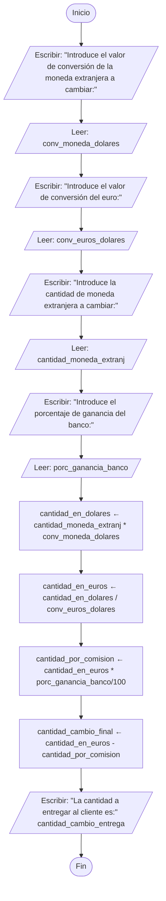

<div align="center">
  <h1> Introducción a la Computación Científica (ICC)</h1>

  <sub>Autor:
<a href="https://www.esi.uclm.es/www/jjcastro/" target="_blank">J.J. Castro-Schez</a><br>
<small> Primera edición: febrero de 2026</small>
</sub>

  <a class="header-badge" target="_blank" href="https://jjcastroschez.github.io">
  
  </a>

</div>

# 🧐 Ejemplos - Tema 2: Algoritmia

En esta carpeta encontrarás algunos **algoritmos** de ejemplo que solucionan algunos problemas planteados en clase, el propósito es que veas el proceso que se sigue en el diseño y especificación de un algoritmo.

> [!NOTE]
> En los ejemplos propuestos no se incluyen estructuras aún no estudiadas en clase (p.e. `if`, `while`, `for`) que se estudiarán con detalle en el **Tema 4**.  
> En el Tema 2, el objetivo no es dominar ningún lenguaje de programación todavía, sino ver cómo un **algoritmo** se traduce a un **programa**.

## Contenido

###  Ejemplo 1. Hacer una pizza

Unos padres se van de viaje y quieren dejar unas instrucciones a su hijo sobre cómo hacer (calentar) una pizza precocinada 🍕. 

#### 🕵️‍♂️ Análisis

El dato de entrada sería la pizza precocinada sin calentar, y el dato de salida sería la pizza calentada. En este caso no hay datos intermedios.

Como todos sabéis calentar una pizza en el horno, no hace falta hacer el análisis 😜. 

El algoritmo en pseudocódigo será:

1. Precalentar el horno a 220°C - 230°C (calor superior e inferior) durante 10-15 minutos.
2. Preparar la pizza retirando todo el envoltorio de plástico y cartón.
3. Colocar la pizza directamente sobre la rejilla del horno a media altura. Esto permite que el aire circule y la base quede crujiente.
4. Hornear la pizza durante 10-15 minutos. El tiempo exacto depende del grosor de la masa. La señal de que está lista es que el queso burbujee y los bordes estén dorados.
5. Retirar la pizza del horno y déjarla enfriar al menos 1 minuto antes de cortarla para que el queso se asiente. 

### 💶 Ejemplo 2. Cambio de moneda

Un banco recibe a diario del Banco Mundial una información sobre cómo está el cambio de las monedas del mundo con respecto del dolar. Diseñar un algoritmo que a partir de la cantidad de moneda extranjera y el cambio actual dé la cantidad en euros correspondiente. Supóngase, además que el banco tiene un tanto por ciento variable de ganancia en el cambio (esta comisión también varía diariamente). 

#### 🕵️‍♂️ Análisis

Se supone que tenemos un listado del tipo: 

| Moneda Origen     | Equivalencia en Dolares |
|:-----------------:|:------------------------|
| 1 Libra Esterlina | 1,33 dolares            |
| 1 Euro            | 1,15 dolares            |
| 1 Franco Suizo    | 1,27 dolares            |
| 1 Leu Rumano      | 0,22 dolares            |
| 1 Yuan Chino.     | 0,14 dolares            |

La informacion de **entrada** que nos debe pedir el programa de conversión será:
1. Valor de cambio a dolares de la moneda recibida del Banco Mundial (`conv_moneda_dolares`).
2. Valor de cambio a dolares del euro recibida del Banco Mundial (`conv_euros_dolares`).
3. Cantidad de moneda extranjera entregada por el cliente (`cantidad_moneda_extranj`).
4. Porcentaje de ganancia del Banco que realiza el cambio por la gestión (`porc_ganancia_banco`). 

Para resolver el problema será necesario cambiar primero la moneda extranjera a dolares (`cantidad_en_dolares`) para después pasarlo a euros (`cantidad_en_euros`). A esta última cantidad tendremos que restarle la comisión o ganancia del banco por la realización del cambio (`cantidad_por_comision`) para ofrecérsela como resultado al usuario (`cantidad_cambio_entrega`). 

Los datos `cantidad_en_dolares`, `cantidad_en_euros` y `cantidad_por_comision` serán **intermedios**. Mientras que `cantidad_cambio_entrega` será de **salida**.

El algoritmo en pseudocódigo será:

```text
Algoritmo CalculoCambioMoneda
Entrada: conv_moneda_dolares, conv_euros_dolares  (número real); cantidad_moneda_extranj, porc_ganancia_banco (número entero)
Intermedias: cantidad_en_dolares, cantidad_en_euros, cantidad_por_comision (número real)
Salida: cantidad_cambio_entrega (número real)
INICIO
  [Entrada de Datos]
  1: ESCRIBIR "Introduce el valor de conversión de la moneda extranjera a cambiar:"
  2: LEER(conv_moneda_dolares)
  3: ESCRIBIR "Introduce el valor de conversión del euro:"
  4: LEER(conv_euros_dolares)
  5: ESCRIBIR "Introduce la cantidad de moneda extranjera a cambiar:"
  6: LEER(cantidad_moneda_extranj) 
  7: ESCRIBIR "Introduce el porcentaje de ganancia del banco:"
  8: LEER(porc_ganancia_banco) 
  [Conversión de la moneda extranjera a dolares]
  9: cantidad_en_dolares ← cantidad_moneda_extranj * conv_moneda_dolares 
  [Conversión de los dolares a euros]
 10: cantidad_en_euros ← cantidad_en_dolares / conv_euros_dolares
  [Cálculo de la comisión del banco]
 11: cantidad_por_comision ← cantidad_en_euros *  porc_ganancia_banco/100
  [Cálculo de la cantidad a entregar]
 12: cantidad_cambio_entrega ← cantidad_en_euros - cantidad_por_comision
  [Salida de datos]
  6: ESCRIBIR "La cantidad a entregar al cliente es:", cantidad_cambio_entrega
FIN
```

El algoritmo expresado en diagramas de flujo será:



<details>
  <summary><h4>⍰ ¿Qué habría que añadir o modificar para obtener al final una cantidad truncada? </h4></summary>
  <p>Habría que añadir un dato más para almacenar el valor truncado <em>cantidad_final_truncada</em> y una instrucción más 13, para obtenerla a partir de <em>cantidad_cambio_entrega</em>, que ahora sería un dato intermedio. El dato de salida sería <em>cantidad_final_truncada</em>.</p>
</details>

### ⚫️ Ejemplo 3. Cálculo del área del círculo

En este caso, se quiere mostrar cómo un algoritmo diseñado finalmente se plasma en un archivo escrito en un lenguajen de programación, en este caso hemos seleccionado Python 🐍, el lenguaje vehicular de la asignatura. 

Partimos del algoritmo diseñado, tanto en pseudocódigo como en diagrama de flujos, en el apartado *Sección 6: Pseudocódigo* y *Sección 7: Diagramas de flujo* de [Teoría](../teoria/T2_ICC.md). 

La implementación será:

- [`01_area_circulo.py`](../ejemplos/01_area_circulo.py): algoritmo secuencial simple.

<details>
  <summary><h4>⍰ ¿Crees que realmente es la implementación que corresponde al algoritmo realizado? </h4></summary>
  <p>No, fíjate que en esta implementación se asume un valor de pi de 3.141592653589793, mientras que en el algoritmo diseñado se deja al usuario que introduzca este valor, aproximándolo como él estime.</p>
</details>

---

## 🧭 Menú de Navegación

| Orden  | Material                                   | Tiempo       | 
|:------:|:-------------------------------------------|:------------:|
| 1      | [Teoría](../teoria/T2_ICC.md)              |      6       |
| 2      | [Recursos](../recursos/T2_RE_ICC.md)       |      5       |
| 3      | **Ejemplos**                               |      -       |
| 4      | [Ejercicios](../ejercicios/T2_Ejer_ICC.md) |      -       |
|        | [Menu del Tema actual](../README.md)       |      -       |