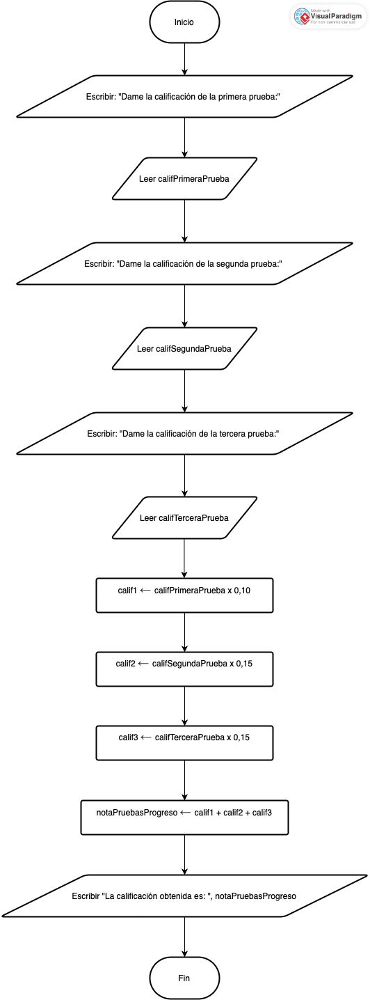

<div align="center">
  <h1> Introducción a la Computación Científica (ICC)</h1>

  <sub>Autor:
<a href="https://www.esi.uclm.es/www/jjcastro/" target="_blank">J.J. Castro-Schez</a><br>
<small> Primera edición: febrero de 2026</small>
</sub>

  <a class="header-badge" target="_blank" href="https://jjcastroschez.github.io">
  
  </a>

</div>

# 🧠 Ejercicios Autocomprobación — Tema 2: Algoritmia  
En este conjunto de ejercicios pondrás en práctica lo visto en clase sobre **algoritmos**, **pseudocódigo**, **diagramas de flujo** y las **características que deben cumplir los algoritmos** (precisión, finitud, orden, independencia, robustez…).

👉 *Recuerda:* antes de programar **hay que pensar**. El objetivo de este tema es **diseñar soluciones**, no escribir código todavía.

---

## Conceptos: ¿es realmente un algoritmo?

### 📝 Ejercicio: "¿Algoritmo o descripción vaga?"

A continuación tienes un **algoritmo cualitativo** (en lenguaje natural).  

🍳 *Algoritmo cualitativo inicial: “Qué hacer para aprobar la asignatura de ICC”*
```text
1. Estudiar lo necesario.
2. Hacer las pruebas de progreso cuando toque y hacerlo lo mejor posible.
3. Completar algunos ejercicios individuales.
4. Participar en los trabajos en grupo de manera adecuada.
5. Entregar todo a tiempo.
6. Repasar antes del examen final si crees que lo necesitas.
```

#### Tu tarea es:

1. Identificar si **cumple** las características fundamentales de un algoritmo:  
   - Preciso  
   - Ordenado  
   - Finito  
   - Legible  
   - Independiente del lenguaje  
   - Robusto / sin ambigüedades  
2. Indicar **qué pasos NO cumplen alguna característica**.  

<details>
  <summary><h4>💡 Piensa en si te deja claro lo que tienes que hacer para aprobar la asignatura ...  </h4></summary>
  <p>Efectivamente... Este algoritmo NO cumple varias características fundamentales:</p>
   <ul style="list-style-type: none;">
      <li>❌ No es preciso: “lo necesario”, “algunos ejercicios”, “de manera adecuada”… no indican nada operativo.</li>
      <li>❌ No es definido: no queda claro cuántas actividades hay que completar ni qué criterios se aplican.</li>
      <li>❌ No es robusto: no contempla situaciones como suspender una prueba, faltas de entrega, etc.</li>
      <li>❌ No es legible desde el punto de vista algorítmico: mezcla tareas sin jerarquía ni relación entre ellas.</li>
      <li>❌ No es ordenado: hay acciones que dependen de otras pero no están ordenadas.
      <li>❌ No refleja entradas, procesos ni salidas.</li>
      <li>❌ No es finito en el sentido algorítmico: “estudiar lo necesario” no está acotado.</li>
   </ul>
</details>

> [!NOTE]
> No olvides este ejemplo, y piensa qué es necesario modificar para reflejar los criterios de evaluación de las asignatura cumpliendo los requisitos vistos en teoría (consulta 📘 *Sección 2: Características de un buen algoritmo* en la [teoría](../teoria/T2_ICC.md)).
> 🧠 *Reflexiona:* ¿Qué partes podrían/deberían complicarse para ajustarse a la forma real de evaluar la asignatura?

### 📝 Ejercicio: "¿Cumple este algoritmo cuantitativo las características de un algoritmo?"

A continuación tienes un **algoritmo cuantitativo simple**, únicamente con **instrucciones secuenciales**:

📐 *Algoritmo Propuesto: Cálculo de área del cuadrado*
```text
Entrada: lado (número real)  
Intermedias: —  
Salida: area (número real)

INICIO
1. ESCRIBIR "Introduce la longitud del lado:"  
2. LEER(lado)  
3. area ← lado * lado  
4. ESCRIBIR "El área es:", area  
FIN
```
---

### ✔️ Tareas

1. Evalúa si cumple TODAS las características de un algoritmo vistas en clase.  
2. Justifica cada respuesta (una frase por característica es suficiente).  
3. En caso necesario, propón mejoras.

<details>
  <summary><h4>💡 Piensa en piensa en finitud, determinismo, precisión y robustez...</h4></summary>
  <p>Efectivamente... Este algoritmo SI cumple las características fundamentales.</p>
</details>

---

## Del enunciado a entrada/salida

### ✅ Ejercicio: "Identifica los datos de entrada y salida, así como los intermedios"

Te propongo que pienses en varios problemas y en sus soluciones:

a) Calcular el área de un triángulo.  
b) Convertir grados Celsius a Fahrenheit.  
c) Sumar los dígitos que forman un número de tres cifras.

#### La tarea a realizar es: 

Para cada uno de ellos, identifica cuáles sería los datos de **Entrada**, **Intermedios** y **Salida**.

<details>
  <summary><h4>🧪 Piensa en lo que necesitas para construir el algoritmo que soluciona el problema y en qué es lo que buscas....</h4></summary>
  <p>Problema a):</p> 
   <ul style="list-style-type: none;">
      <li><strong>Entrada:</strong> base, altura (reales).</li> 
      <li><strong>Intermedias:</strong> - <strong></li>
      <li>Salida:</strong> area (real).</li>
   </ul>
  <p>Problema b):</p> 
   <ul style="list-style-type: none;">
      <li><strong>Entrada:</strong> grados Celsius (reales).</li> 
      <li><strong>Intermedias:</strong> - <strong></li>
      <li>Salida:</strong> grados Fahrenheit (real).</li>
   </ul>
 <p>Problema c):</p> 
   <ul style="list-style-type: none;">
      <li><strong>Entrada:</strong> numero (entero entre 100 y 999).</li> 
      <li><strong>Intermedias:</strong> unidades, decenas y centenas (entero) <strong></li>
      <li>Salida:</strong> resultado de la suma (entero).</li>
   </ul>   
</details>

---

## De la idea al algoritmo: Diseñando y escribiendo algoritmos

### 📝 Ejercicio: "Diseña un algoritmo (cualitativo, expresado en pseudocódigo y diagrama de flujo)"

Un profesor quiere automatizar un pequeño proceso:  *al recibir las tres calificaciones obtenidas por un estudiante en las pruebas de progreso (en el rango 0 a 10), quiere (1) calcular la nota final sobre 4 puntos teniendo en cuenta que la primera prueba tiene un peso de 1 punto, y la segunda y tercera de 1.5 puntos; y (2) mostrar el resultado al estudiante.*

#### ✔️ Tareas

1. Escribe un **algoritmo cualitativo** (en lenguaje natural).  
2. Transfórmalo en **pseudocódigo** siguiendo el formato visto en teoría.  
   Consulta 📘 *Sección 6: Pseudocódigo* en la [teoría](../teoria/T2_ICC.md).  
3. Representa el mismo algoritmo mediante un **diagrama de flujo** usando los símbolos estándar (terminal, entrada/salida, proceso…).  
   Consulta 📘 *Sección 7: Diagramas de flujo*.

Puedes hacerlo a mano o usando herramientas como: 
- Visual Paradigm 
- draw.io  
- Mermaid  
- Lucidchart  
- Canva  
- PlantUML  
*(ver opciones en [Recursos del Tema 2](../recursos/T2_RE_ICC.md))*.

> [!NOTE]
> Observa cómo la solución se vuelve más precisa y formal conforme avanzamos desde lenguaje natural → pseudocódigo → diagrama de flujo.

<details>
  <summary><h4>💡 Piensa... antes de programar 😜 </h4></summary>
  <p>Recuerda que no todos los algoritmos tienen que ser iguales, aunque cuando son simples, lo normal es que sean parecidos. Aquí va mi propuesta...</p>
  <p>Un algoritmo cualitativo sería una primera aproximación a la solución del problema:</p>
  <pre>
   1. Pedir/recibir las tres notas del estudiante.
   2. Calcular la calificación final según los pesos de cada prueba.
   3. Sumar las tres notas.
   4. Mostrar la nota final al estudiante. 
  </pre>
  <p>Vamos a detallar mejor el algoritmo, empleando para ello pseudocódigo:</p>
  <pre>
   Entrada: califPrimeraPrueba, califSegundaPrueba, califTerceraPrueba (número real)  
   Intermedias: calif1, calif2, calif3 (número real)  
   Salida: notaPruebasProgreso (número real)

   INICIO
     1. ESCRIBIR "Dame la calificación de la primera prueba:"   
     2. LEER(califPrimeraPrueba)
     3. ESCRIBIR "Dame la calificación de la segunda prueba:"   
     4. LEER(califSegundaPrueba)
     5. ESCRIBIR "Dame la calificación de la tercera prueba:"   
     6. LEER(califTerceraPrueba)    
     7. calif1 ← califPrimeraPrueba x 0.10
     8. calif2 ← califSegundqPrueba x 0.15
     9. calif1 ← califTerceraPrueba x 0.10 
    11. notaPruebasProgreso ← calif1 + calif2 + calif3   
    10. ESCRIBIR "La calificación obtenida es: ", notaPruebasProgreso 
   FIN
  </pre>
  <p>A continuación, muestro el diagrama de flujo del algoritmo propuesto, está realizado con Visual Paradigm:</p>
  <figure>
    
    <figcaption>Diagrama de Flujo para el problema de las notas</figcaption>
  </figure> 
</details>

### 📝 Ejercicio: "Diseña un algoritmo secuencial (pseudocódigo + diagrama de flujo)"

Diseña un algoritmo que:

- establezca los pasos para recibir un número real (temperatura en grados Celsius),  
- convierta dicha temperatura a grados Fahrenheit usando la fórmula:  
  
  $F = (C × 9/5) + 32$

- y muestre el resultado al usuario.

#### ✔️ Tareas

1. Escribe el **pseudocódigo completo** siguiendo la plantilla del tema.  
2. Representa tu solución en un **diagrama de flujo**.
3. Revisa y valida usando el checklist del final de la teoría.

<details>
  <summary><h4>💡 Un último ejercicio para acostumbrarte a pensar 😜 </h4></summary>
  <p>Mi propuesta para este caso, y debe varia poco de la tuya, es la siguiente.</p>
  <p>Empiezo con la especificación del algoritmo en pseudocódigo:</p>
  <pre>
   Entrada: gradosCelsius (número real)  
   Intermedias: -  
   Salida: gradosFahrenheit (número real)

   INICIO
     1. ESCRIBIR "Dame la temperatura en Grados Celsius:"   
     2. LEER(gradosCelsius)
       [Aplicamos la fórmula de conversión]
     3. gradosFahrenheit ← (gradosCelsius × 9/5) + 32   
     4. ESCRIBIR "La calificación obtenida es: ", gradosFahrenheit 
   FIN
  </pre>
  <p>El diagrama de flujo del algoritmo, realizado con draw.io, es el siguiente:</p>
  <figure>
    
    <figcaption>Diagrama de Flujo para el problema de las notas</figcaption>
  </figure> 
</details>

---

## 🧭 Menú de Navegación

| Orden  | Material                                   | Tiempo       | 
|:------:|:-------------------------------------------|:------------:|
| 1      | [Teoría](../teoria/T2_ICC.md)              |      6       |
| 2      | [Recursos](../recursos/T2_RE_ICC.md)       |      5       |
| 3      | [Ejemplos](../ejemplos/T2_Ejem_ICC.md)     |      -       |
| 4      | **Ejercicios**                             |      -       |
|        | [Menu del Tema actual](../README.md)       |      -       |