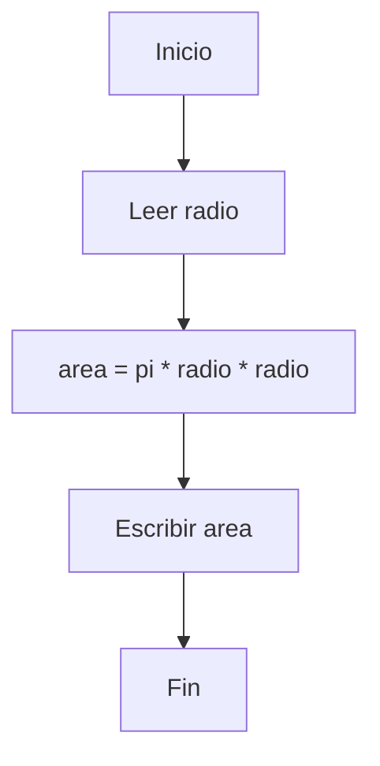

  <h1> Introducción a la Computación Científica (ICC)</h1>

  Autor:
<a href="https://www.esi.uclm.es/www/jjcastro/" target="_blank">J.J. Castro-Schez</a> 
<small> Primera edición: febrero de 2026</small>

  

# 🎓 Recursos - Tema 2: Algoritmia 🧩

A continuación se listan herramientas y recursos útiles para practicar el **diseño y representación de algoritmos** (pseudocódigo y diagramas de flujo).

---

## 🧾 Pseudocódigo

### ✅ Reglas prácticas (muy recomendadas)
1. **Usa nombres claros**: `radio`, `area`, `suma`, `contador`.
2. **Indica entrada / intermedias / salida** (siempre que el problema lo permita).
3. **Mantén el pseudocódigo independiente del lenguaje** (no uses `print()`, `input()`, etc.).
4. **Estructura y sangría**: que se vea qué está dentro de un `Si`, `Mientras`, etc.
5. **Evita ambigüedades**: si una condición no está completa, el algoritmo no está completo.

---

## 📊 Diagramas de flujo

### Herramientas online (sin instalar nada)
- **diagrams.net (draw.io)**: editor gratuito, exporta a PNG/SVG/PDF.
- **Lucidchart**: muy potente (tiene plan gratuito limitado).
- **Canva**: tiene plantillas de diagramas, útil si quieres un estilo visual cuidado.
- **Miro**: pizarra colaborativa (ideal para trabajar en grupo).

### Herramientas “ligeras” para apuntes y GitHub
- **Mermaid**: permite escribir diagramas en texto y renderizarlos (GitHub soporta Mermaid).
- **PlantUML**: diagramas a partir de texto, muy usado en entornos técnicos.

#### Ejemplo rápido con Mermaid (flowchart)

> [!TIP]
> Si te interesa documentar algoritmos dentro del repositorio, **Mermaid** suele ser la opción más cómoda porque el diagrama se “versiona” como texto.

---

## 📚 Lecturas y referencias recomendadas

- Tutorial oficial de Python (para cuando empecemos a implementar): https://docs.python.org/3/tutorial/
- Conceptos básicos de algoritmos (entrada/salida, pasos, finitud): cualquier texto introductorio de programación.
- Diagramas de flujo (símbolos y convenciones): busca “flowchart symbols” y revisa tablas comparativas.

---

## 🧭 Menú de Navegación

| Orden  | Material                                   | Tiempo       | 
|:------:|:-------------------------------------------|:------------:|
| 1      | [Teoría](../teoria/T2_ICC.md)              |      6       |
| 2      | **Recursos**                               |      5       |
| 3      | [Ejemplos](../ejemplos/T2_Ejem_ICC.md)     |      -       |
| 4      | [Ejercicios](../ejercicios/T2_Ejer_ICC.md) |      -       |
|        | [Menu del Tema actual](../README.md)       |      -       |
