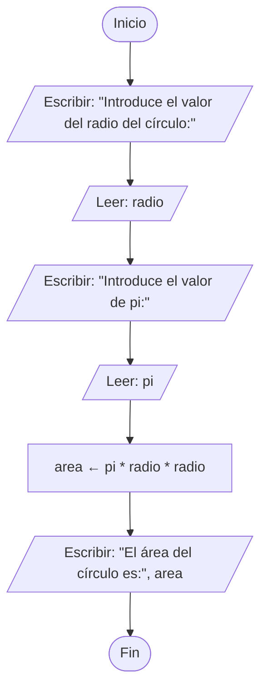
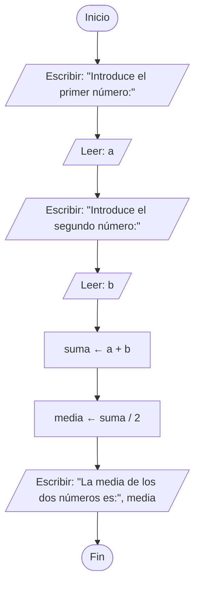

<div align="center">
  <h1> Introducción a la Computación Científica (ICC)</h1>

  <sub>Autor:
<a href="https://www.esi.uclm.es/www/jjcastro/" target="_blank">J.J. Castro-Schez</a><br>
<small> Primera edición: febrero de 2026</small>
</sub>

  <a class="header-badge" target="_blank" href="https://jjcastroschez.github.io">
  
  </a>

</div>

# Teoría - Tema 2: Algoritmia 🧠

En este tema nos centramos en el *diseño de la solución* (el algoritmo), antes de preocuparnos por cómo escribirla en un lenguaje de programación.

> [!IMPORTANT]
> **No corras.** Antes de programar, diseña la solución. Es más barato corregir un algoritmo mal planteado que depurar un programa caótico.

---

## 🧩 Sección 1: ¿Qué es un algoritmo?

Un **algoritmo** es una secuencia **clara, ordenada y finita** de pasos o instrucciones que se siguen para resolver un problema o realizar una tarea específica.

### 📥 Entradas, intermedios y salidas
Un algoritmo:
- parte de **cero o más datos de entrada** (información proporcionada al comienzo),
- puede construir **datos intermedios** (datos auxiliares obtenidos),
- y produce **al menos una salida** (resultado).

Cada paso del algoritmo debe ser un paso *hacia la solución*.

### 🍳 Analogía rápida: receta de cocina

Un algoritmo puede verse como una receta de cocina. Los **datos de entrada** serían los *ingredientes* que vamos a usar en la receta para elaborar el plato (p.e. 50ml aceite, 2kg de tomates maduros, 1 calabacín, 1 pimiento verde, 1 pimiento rojo, 1 cebolla, 1 ajo y 5gr de sal), los **datos intermedios** serían los *productos intermedios* que se producen (p.e. el sofrito o la salsa de tomate casera), y los **datos de salida** serían el *plato elaborado* (p.e. el pisto manchego). 

La receta paso a paso es el algoritmo (el procedimiento ordenado), por ejemplo:
```text
1. Lavar ingredientes.
2. Cortar los tomates, el ajo, la cebolla, el calabacín y los pimientos rojo y verde. 
3. Calentar el aceite en la sartén.
4. Echar el ajo, la cebolla y pimientos troceados en en la sartén.
5. Sofreir a fuego lento durante 10 minutos.
6. Añadir el calabacín.
7. Sofreir a fuego lento durante 10 minutos
8. Reservar el sofrito en un recipiente.
9. Calentar aceite en una sartén.
10. Añadir el tomate troceado y dejar a fuego lento, removiendo de vez en cuando, durante una hora.
11. Mezclar la salsa de tomate obtenida con el sofrito antes elaborado.
12. Servir
```

> \[!NOTE]
> El orden importa. Si “calientas la sartén” después de “sofreir”, algo no encaja.

> \[!WARNING]
> ¡No intente hacer esto en su casa! Es más que posible que el auténtico "pisto manchego" no te salga como el de tu madre/padre o abuela/abuelo seguro 😝. 

Otros ejemplos de algoritmos cotidianos:
* Las instrucciones de montaje que vienen con cualquier mueble de IKEA.
* El procedimiento que sigues para lavarte las manos o los dientes.
* Las indicaciones de una ruta de GPS para ir del punto A al punto B.

---

## ✅ Sección 2: Características de un buen algoritmo

Un buen algoritmo debe ser:

- **Preciso**: sin ambigüedades, se interpreta siempre igual.  
- **Robusto**: no contiene errores lógicos evidentes (y contempla casos razonables).  
- **Definido**: para la misma entrada, produce la misma salida (determinismo).  
- **Ordenado**: deja claro el orden de ejecución de los pasos.  
- **Finito**: termina en algún momento (no se queda en un bucle “eterno”).  
- **Independiente**: no depende de un lenguaje concreto (no uses `print`, `scanf`, etc. en el algoritmo).  
- **Legible**: comprensible para otra persona (o para tu “yo” del futuro, puede que tengas que mantenerlo 😜).

> [!TIP]
> Si un algoritmo no es legible, es *difícil de validar* y *difícil de mantener*.

---

## 🎸 Sección 3: No hay una única solución

Distintos algoritmos pueden resolver el mismo problema. La pregunta entonces es: **¿cuál elegir?**. Normalmente, buscamos el más eficiente (en **tiempo** y **memoria**, es decir se analiza la complejidad *temporal* y *espacial*) *sin perder claridad*.

Con **complejidad temporal** nos referimos al tiempo que tarda en ejecutarse en función del tamaño de los datos de entrada. Con **complejidad espacial** se hace referencia a la cantidad de memoria que se utiliza en función también del tamaño de los datos de entrada. 

Veamos un ejemplo rápido. Supongamos que queremos sumar los *n* primeros números (suma de los números 1..n). Para resolver este problema se nos puede ocurrir dos algoritmos:

- Algoritmo A: sumar valor a valor hasta alcanzar n (tiempo dependiente de n, se realizan n sumas).
- Algoritmo B: usar la fórmula de Gauss $\frac{n(n+1)}{2}$ (tiempo constante).

> [!NOTE]
> En este curso introduciremos la eficiencia de forma gradual. Lo importante aquí es interiorizar que *dos soluciones correctas* pueden tener costes muy distintos.

---

## 🧩 Sección 4: Tipos de estructuras de un algoritmo (programación estructurada)

Según el **teorema de la programación estructurada**, cualquier programa puede escribirse utilizando solo tres estructuras de control:

1. **Secuencia**: estructuras para la ejecución de instrucciones una vez, y en orden.
2. **Selección**: estructuras que permiten ejecutar o no instrucciones en función de una condición.
3. **Iteración**: estructuras que permiten repetir la ejecución de instrucciones un número variable de veces.

> [!IMPORTANT]
> Simplemente combinando estas tres estructuras, es posible expresar cualquier función computable.

---

## 🧾 Sección 5: ¿Cómo se expresan los algoritmos?

Un algoritmo se puede expresar de muchas formas:

- **Lenguaje natural**: útil, pero puede ser ambiguo.
- **Pseudocódigo**: muy usado en docencia y diseño.
- **Diagramas de flujo**: gráficos y muy intuitivos.
- Otras: diagramas Nassi–Shneiderman, notaciones formales, UML (diagramas de actividad), etc.

La elección depende del **contexto**, el **público objetivo** y el **propósito**.

---

## 🔠 Sección 6: Pseudocódigo

El pseudocódigo busca un equilibrio: estructura parecida a un programa, pero **sin depender** de un lenguaje.

### 📌 Plantilla recomendada
```text
ALGORITMO nombre_algoritmo
  Entrada: ...
  Intermedias: ...
  Salida: ...
INICIO
     [Comentario sobre el paso 1]
  1: ...
  2: ...
  ...
  n: ...
FIN
```

> [!NOTE]
> Observa como se añaden comentarios para aclarar cosas en el algoritmo. 

Ahora veamos dos ejemplos simples, aumentaremos la complejidad conforme avancemos en el estudio de los lenguajes de programación en los siguientes temas:

### 🧮 Ejemplo: área de un círculo
```text
ALGORITMO calculo_area_circulo
  Entrada: radio (número real), pi (número real)
  Intermedias: -
  Salida: area (número real)
INICIO
  1: ESCRIBIR "Introduce el valor del radio del círculo:"
  2: LEER(radio)
  3: ESCRIBIR "Introduce el valor de pi:"
  4: LEER(pi)
     [Calculamos el área del círculo empleando la fórmula]
  5: area ← pi * radio * radio
  6: ESCRIBIR "El área del círculo es:", area
FIN
```
### 🧮 Ejemplo: media aritmética de dos números
```text
ALGORITMO calculo_media_dos_numeros
  Entrada: a (número real), b (número real)
  Intermedias: suma (número real)
  Salida: media (número real)
INICIO
  1: ESCRIBIR "Introduce el primer número:"
  2: LEER(a)
  3: ESCRIBIR "Introduce el segundo número:"
  4: LEER(b)
     [Usamos un valor intermedio, para mostrar este tipo de dato]
  5: suma ← a + b
  6: media ← suma / 2
  7: ESCRIBIR "La media de los dos números es:", media
FIN
```

> [!TIP]
> Aunque el pseudocódigo incluya “Leer/Escribir”, piensa en ello como *abstracciones* de entrada/salida, no como funciones concretas de un lenguaje.

---

## 📊 Sección 7: Diagramas de flujo

Los **diagramas de flujo** representan un algoritmo gráficamente mediante **símbolos** estándar y flechas de flujo. Son populares para:
- representar algoritmos,
- documentar procesos,
- visualizar decisiones y ramificaciones,
- mejorar sistemas (procesos administrativos, industriales, etc.).

### 🔷 Símbolos habituales
- **Terminal**: inicio/fin (óvalo). 
- **Entrada/Salida**: leer o mostrar información (paralelogramo).
- **Proceso**: operación/cálculo/asignación (rectángulo).
- **Decisión**: bifurcación (sí/no) (rombo/diamante).
- **Conectores**: unión dentro/fuera de página (círculo (Conector de la misma página) o pentágono/"Casita" hacia abajo (Conector de página diferente)).
- **Operación manual**: intervención humana (trapecio).
- **Flechas**: dirección del flujo.

### ✅ Restricciones recomendadas (para diagramas claros)
- Un solo **inicio** y un solo **fin**.
- Construcción **top-down** (arriba→abajo) y **left-to-right** (izquierda→derecha).
- Usar líneas rectas.
- A cada símbolo le llega solo una línea de flujo (se usan los conectores para lograrlo).
- Notación **independiente** del lenguaje final.

Veamos dos ejemplos simples de diagramas de flujo, que corresponden a los algoritmos vistos anteriormente:

### 🧮 Ejemplo: área de un círculo

### 🧮 Ejemplo: media aritmética de dos números

En próximos temas se aumentará la complejidad de los diagramas, para representar gráficamente construcciones o estructuras más complejas de los lenguajes de programación.

---

## 🧭 Sección 8: Clasificación de los algoritmos

Los algoritmos, como casi todo, también pueden ser clasificados. Su clasificación se hace en función de varios aspectos. A continuación, se muestran algunas posibles clasificaciones en función de diversos aspectos, por ejemplo:

* **Según su naturaleza** (sistema de instrucciones): *cualitativos*, son instrucciones narrativas o descriptivas para guiar un proceso (p.e. una receta para preparar un plato) o *cuantitativos*, se emplean cálculos matemáticos u operaciones de comparación numérica para obtener un resultado (p.e. el cálculo del área del círculo).
* **Según su función**: *de búsqueda*, buscan un elemento concreto en una colección de ellos (p.e. secuenciales o binaria); *de ordenamiento*, ordenan una colección de elementos (p.e. de burbuja——bubble Sort; o por seleccion——selection sort; o rápido——quicksort; o por mezcla——merge sort); *de clasificación*, clasifican una serie de elementos en clases (p.e. árboles de decisión, K-vecinos más cercanos, Naive Bayes, Redes Neuronales, Random Forest, Gradient Boosting); 
*de aprendizaje*, infieren conocimiento a partir de datos particulares, se clasifican a su vez en supervisado, no supervisado, profundo y por refuerzo; *de encaminamiento*...
* **Según su estrategia de resolución**: *fuerza bruta*——brute force, se prueban todas las soluciones hasta encontrar la correcta (p.e. búsqueda secuencial o  ordenación por selección); *divide y vencerás*——divide and conquer, se divide el problema principal en subproblemas más pequeños que son resueltos de manera individual, para luego combinar las soluciones y obtener de este modo la solución al problema de partida (p.e. Quicksort, mergesort o la búsqueda binaria); *voraces*——greedy, dividen la solución en pasos, tomando en cada paso la mejor decisión local, con la esperanza de obtener la mejor solución global (p.e. Dijkstra o Kruskal), *programación dinámica*——dynamic programming, similar al "divide y vencerás", pero en el que hay solapamiento de los problemas, se requiere emplear soluciones a subproblemas para solucionar otros subproblemas (p.e. cálculo de la serie de Fibonacci); *vuelta atrás*——backtracking, es una mejora de "la fuerza bruta" se construyen soluciones parciales que se descartan si se comprueba que no conducen a una solución final válida (p.e. solución de sudokus o la salida de un laberinto); *aleatorizados*, incluyen el azar como parte de su lógica para tomar decisiones durante la ejecución (p.e. Quicksort aleatorizado).

* **Según la certeza del resultado**: *determinísticos*, ante los mismos datos de  entrada se ejecuta la misma secuencia de instrucciones y se produce produce la misma salida (p.e. multiplicación de matrices); *probabilísticos*, se introduce el azar, en cada ejecución el resultado puede ser distinto aún partiendo de los mismos datos de entrada (p.e. simulaciones de Montecarlo); *heurísticos*, no buscan la mejor solución o la solución perfecta, sino una solución "suficientemente buena" con recursos razonables (p.e. generación de una ruta en Google Maps).  

---

## 🧭 Sección 9: Del problema al programa

El fujo de trabajo habitual será:

1. **Análisis del problema**: determina cuáles son los datos de entrada y la salida esperada, analiza si hay casos especiales o restricciones en la entrada.
2. **Diseño del algoritmo**: piensa en cómo solucionar el problema, redacta el algoritmo y verifica sus propiedades.
3. **Selección del lenguaje**: elige el lenguaje y herramientas más apropiados.
4. **Implementación**: traduce el algoritmo al lenguaje elegido.

---

## ✅ Mini-checklist de autoevaluación

Antes de dar por bueno tu algoritmo, comprueba:

- [ ] ¿Has identificado claramente **entrada**, **intermedios** y **salida**?
- [ ] ¿Los pasos están en orden y **sin ambigüedad**?
- [ ] ¿Hay un punto de entrada y otro de salida?
- [ ] ¿El algoritmo **termina** siempre?
- [ ] ¿La representación es **independiente** del lenguaje?
- [ ] ¿Otra persona podría entenderlo sin preguntarme?

---

## 🧭 Menú de Navegación

| Orden  | Material                                   | Tiempo       | 
|:------:|:-------------------------------------------|:------------:|
| 1      | **Teoría**                                 |      6       |
| 2      | [Recursos](../recursos/T2_RE_ICC.md)       |      5       |
| 3      | [Ejemplos](../ejemplos/T2_Ejem_ICC.md)     |      -       |
| 4      | [Ejercicios](../ejercicios/T2_Ejer_ICC.md) |      -       |
|        | [Menu del Tema actual](../README.md)       |      -       |
