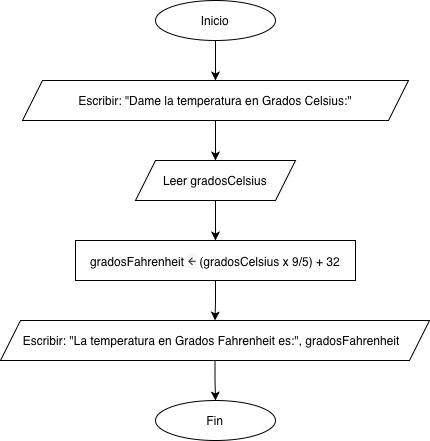
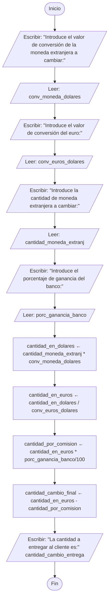

<div align="center">
  <h1> Introducción a la Computación Científica (ICC)</h1>

  <sub>Autor:
<a href="https://www.esi.uclm.es/www/jjcastro/" target="_blank">J.J. Castro-Schez</a><br>
<small> Primera edición: febrero de 2026</small>
</sub>

  <a class="header-badge" target="_blank" href="https://jjcastroschez.github.io">
  
  </a>

</div>

# 🔨Ejercicios Autocomprobación — Tema 3: Tipos de Datos y Variables 🔤 
En esta sección te propongo algunos ejercicios para que asimiles los nuevos contenidos y los relacines con lo visto en clase sobre **tipos de datos básicos** o **simples**, **variables** y **operaciones** con ellas.

En el [Tema 2](../../02_algoritmos/README.md) ya hemos diseñado algunos algoritmos simples, con sentencias simples (asignación, lectura desde teclado y escritura en pantalla), en este tema te propongo que los implementes. 

>[!WARNING]
> 👉 **Recuerda:** antes de programar **hay que pensar**. El objetivo de este tema es **implementar** algoritmos no escribir código directamente.

---

## Conceptos: Variables

### 📝 Ejercicio: "Implementando el 📐 algoritmo para el Cálculo de área del cuadrado"

En el [Tema 2](../../02_algoritmos/ejercicios/T2_Ejer_ICC.md) ya hemos creado el algoritmo que soluciona el problema:

```text
ALGORITMO calculo_area_cuadrado
  Entrada: lado (número real)  
  Intermedias: —  
  Salida: area (número real)

INICIO
  1. ESCRIBIR "Introduce la longitud del lado:"  
  2. LEER(lado)  
  3. area ← lado * lado  
  4. ESCRIBIR "El área es:", area  
FIN
```

#### ✔️ Tareas

1. Implementa la solución usando Python.  
2. Implementa la solución usando C.
3. Ejecútalas...


<details>
  <summary><h4>🫣 Mira como quedarían las implementaciones...</h4></summary>
  <p><a href="area_cuadrado.py">Solución implementada en Python</a>.</p>
  <p><a href="area_cuadrado.c">Solución implementada en C</a>.</p>
</details>

### 📝 Ejercicio: "Implementando la solución del cálculo de la nota"

El algoritmo que emplea el profesor para el cálculo de la nota ya lo habíamos diseñado en el [Tema 2](../../02_algoritmos/ejercicios/T2_Ejer_ICC.md)

```text
ALGORITMO calculo_nota_pruebas

  Entrada: califPrimeraPrueba, califSegundaPrueba, califTerceraPrueba (número real)  
  Intermedias: calif1, calif2, calif3 (número real)  
  Salida: notaPruebasProgreso (número real)

INICIO
  1. ESCRIBIR "Dame la calificación de la primera prueba:"   
  2. LEER(califPrimeraPrueba)
  3. ESCRIBIR "Dame la calificación de la segunda prueba:"   
  4. LEER(califSegundaPrueba)
  5. ESCRIBIR "Dame la calificación de la tercera prueba:"   
  6. LEER(califTerceraPrueba)    
  7. calif1 ← califPrimeraPrueba x 0.10
  8. calif2 ← califSegundaPrueba x 0.15
  9. calif3 ← califTerceraPrueba x 0.10 
  11. notaPruebasProgreso ← calif1 + calif2 + calif3   
  10. ESCRIBIR "La calificación obtenida es: ", notaPruebasProgreso 
FIN
```

#### ✔️ Tareas

1. Implementa la solución usando Python.  
2. Implementa la solución usando C.
3. Ejecútalas...

<details>
  <summary><h4>🫣 Mira como quedarían las implementaciones...</h4></summary>
  <p><a href="calculo_nota.py">Solución implementada en Python</a>.</p>
  <p><a href="calculo_nota.c">Solución implementada en C</a>.</p>
</details>


### 📝 Ejercicio: "Implementando el cambio de unidad en temperaturas"

El algoritmo diseñado es:

```text
ALGORITMO conversion_celsius_fahrenheit
  Entrada: gradosCelsius (número real)  
  Intermedias: -  
  Salida: gradosFahrenheit (número real)

INICIO
  1. ESCRIBIR "Dame la temperatura en Grados Celsius:"   
  2. LEER(gradosCelsius)
        [Aplicamos la fórmula de conversión]
  3. gradosFahrenheit ← (gradosCelsius × 9/5) + 32   
  4. ESCRIBIR "La temperatura en Grados Fahrenheit es: ", gradosFahrenheit
FIN
```
Y el diagrama de flujo:

  <figure>
    
    <figcaption>Diagrama de Flujo para el problema de la conversión de temperaturas</figcaption>
  </figure> 


#### ✔️ Tareas

1. Implementa la solución usando Python.  
2. Implementa la solución usando C.
3. Ejecútalas...

<details>
  <summary><h4>🫣 Mira como quedarían las implementaciones...</h4></summary>
  <p><a href="calculo_nota.py">Solución implementada en Python</a>.</p>
  <p><a href="calculo_nota.c">Solución implementada en C</a>.</p>
</details>


### 📝 Ejercicio: "Implementando el cambio de moneda"

El algoritmo en pseudocódigo era:

```text
ALGORITMO calculo_cambio_moneda
  Entrada: conv_moneda_dolares, conv_euros_dolares  (número real); cantidad_moneda_extranj, porc_ganancia_banco (número entero)
  Intermedias: cantidad_en_dolares, cantidad_en_euros, cantidad_por_comision (número real)
  Salida: cantidad_cambio_entrega (número real)
INICIO
     [Entrada de Datos]
  1: ESCRIBIR "Introduce el valor de conversión de la moneda extranjera a cambiar:"
  2: LEER(conv_moneda_dolares)
  3: ESCRIBIR "Introduce el valor de conversión del euro:"
  4: LEER(conv_euros_dolares)
  5: ESCRIBIR "Introduce la cantidad de moneda extranjera a cambiar:"
  6: LEER(cantidad_moneda_extranj) 
  7: ESCRIBIR "Introduce el porcentaje de ganancia del banco:"
  8: LEER(porc_ganancia_banco) 
     [Conversión de la moneda extranjera a dolares]
  9: cantidad_en_dolares ← cantidad_moneda_extranj * conv_moneda_dolares 
     [Conversión de los dolares a euros]
 10: cantidad_en_euros ← cantidad_en_dolares / conv_euros_dolares
     [Cálculo de la comisión del banco]
 11: cantidad_por_comision ← cantidad_en_euros *  porc_ganancia_banco/100
     [Cálculo de la cantidad a entregar]
 12: cantidad_cambio_entrega ← cantidad_en_euros - cantidad_por_comision
     [Salida de datos]
  6: ESCRIBIR "La cantidad a entregar al cliente es:", cantidad_cambio_entrega
FIN
```

El algoritmo expresado en diagramas de flujo será:



---

## 🧭 Menú de Navegación

| Orden  | Material                                   | Tiempo       | 
|:------:|:-------------------------------------------|:------------:|
| 1      | [Teoría](../teoria/T3_ICC.md)              |      6       |
| 2      | [Recursos](../recursos/T3_RE_ICC.md)       |      5       |
| 3      | [Ejemplos](../ejemplos/T3_Ejem_ICC.md)     |      -       |
| 4      | **Ejercicios**                             |      -       |
|        | [Menu del Tema actual](../README.md)       |      -       |