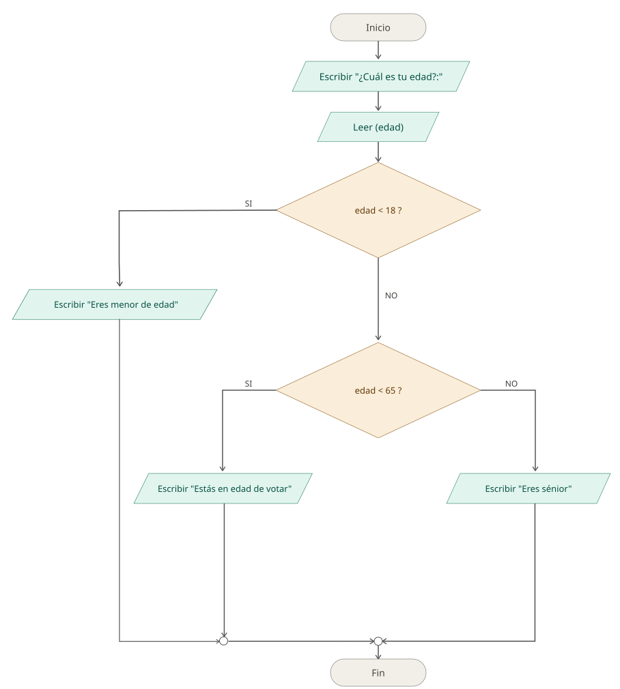
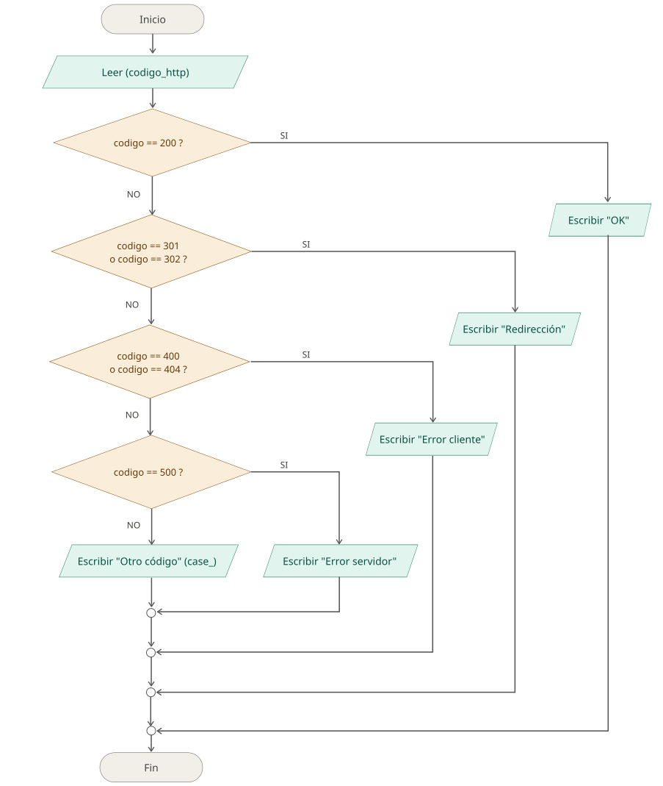
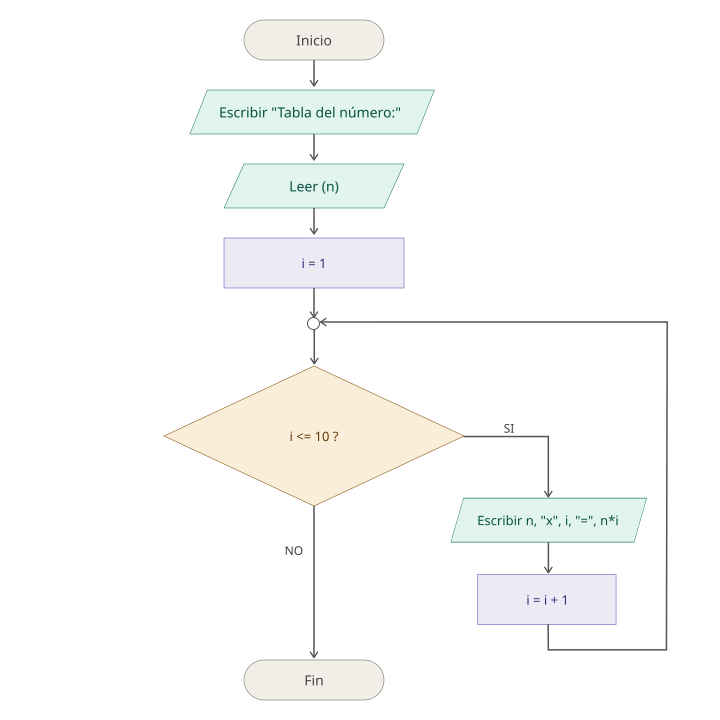
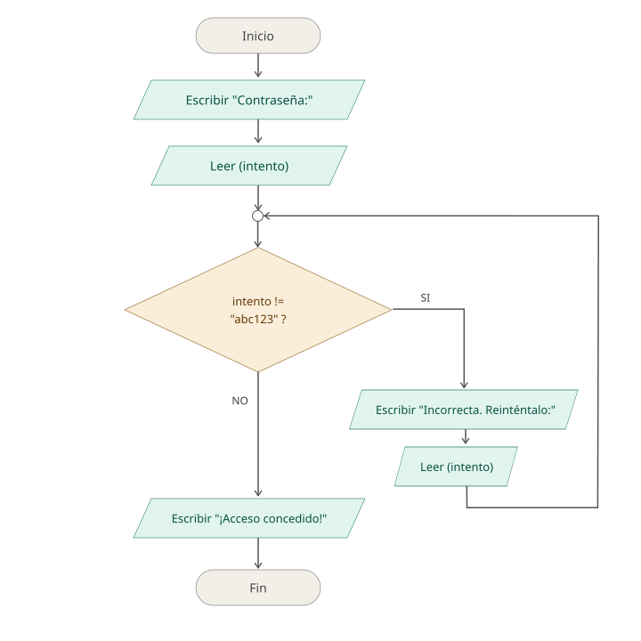
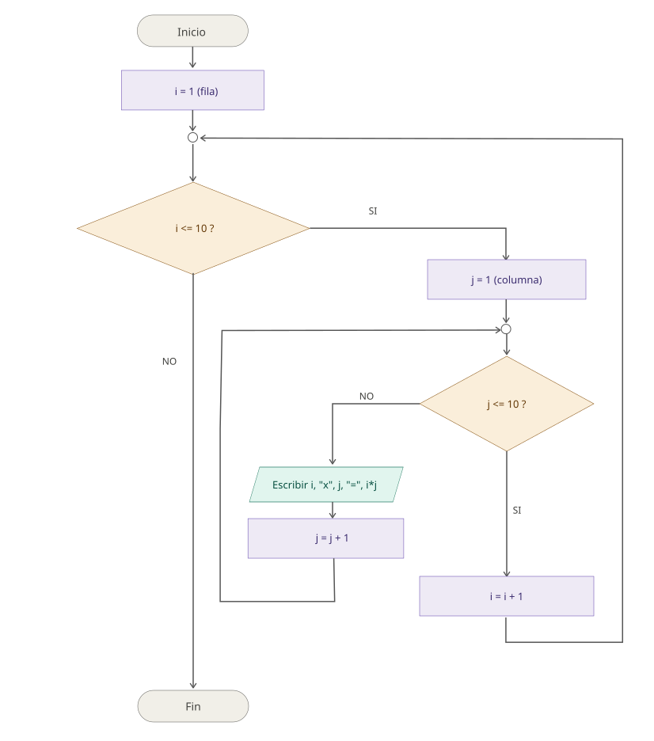
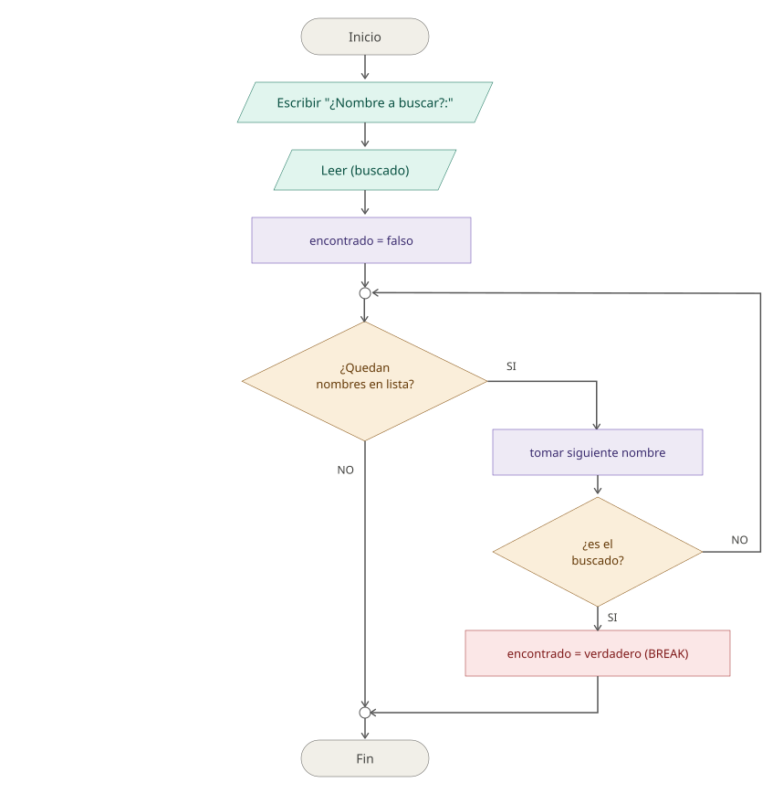
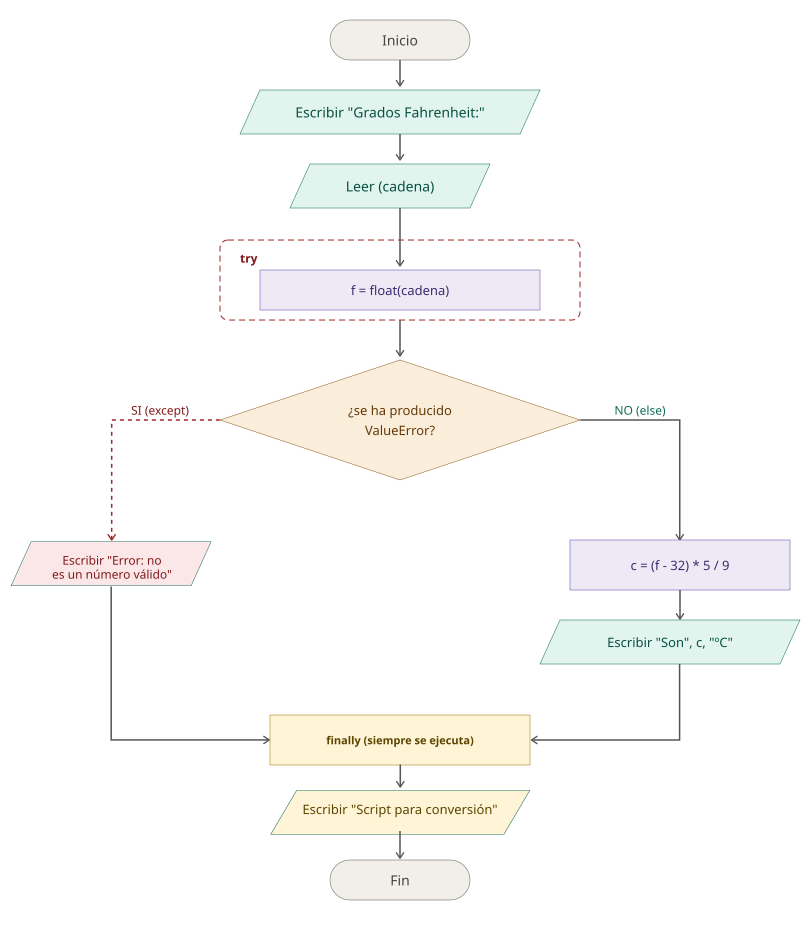

<div align="center">
  <h1> Introducción a la Computación Científica (ICC)</h1>

  <sub>Autor:
<a href="https://www.esi.uclm.es/www/jjcastro/" target="_blank">J.J. Castro-Schez</a><br>
<small> Primera edición: febrero de 2026</small>
</sub>

  <a class="header-badge" target="_blank" href="https://jjcastroschez.github.io">
  
  </a>

</div>

# Teoría - Tema 4: Control del Flujo de Ejecución 🔀

> *"Todo problema computable puede resolverse combinando tres cosas: secuencia, decisión y repetición."*
>
> — Teorema de la Programación Estructurada (Böhm y Jacopini, 1966)

---

## 🎬 Antes de empezar: una analogía

Imagínate una **receta de cocina** muy simple: «echa la pasta a la olla, añade sal, espera 10 minutos, escurre, sirve». Es una secuencia perfecta de pasos. Funciona siempre.

Pero las recetas reales **no son así**. Una receta real dice cosas como:

* «**Si** el agua aún no hierve, espera un poco más.»
* «Remueve **mientras** la salsa esté líquida.»
* «**Por cada** comensal, echa 100 gr.»
* «Si se te quema, **prueba** otra vez con menos fuego.»

Esos «si», «mientras», «por cada» y «prueba otra vez» son exactamente lo que en este tema vas a aprender a expresar en código. Sin ellos, un programa solo sirve para **un caso concreto**; con ellos, un programa puede adaptarse a **cualquier situación que se le presente**.

> [!TIP]
> El control del flujo es lo que separa una *lista de instrucciones* de un **programa**. Es donde aparece la inteligencia.

---

## 🗺️ Mapa del tema

| Sección | Concepto | Pregunta que responde |
| :-: | :--- | :--- |
| 1 | Decisión (`if`) | *"¿Qué hago según el caso?"* |
| 2 | Repetición (`for`, `while`) | *"¿Cómo hago algo muchas veces?"* |
| 3 | Anidamiento | *"¿Y si lo combino?"* |
| 4 | Ruptura del flujo | *"¿Cómo salgo antes?"* |
| 5 | Excepciones | *"¿Y si algo va mal?"* |
| 6 | Buenas prácticas | *"¿Cómo evito hacerlo mal?"* |

---

## 1️⃣ Decisión: el cruce de caminos

Una sentencia condicional es un **cruce** en el flujo del programa. El programa llega al cruce, **evalúa una condición** (una expresión booleana) y, según el resultado, toma un camino u otro.

### 🧩 Tres preguntas que debes hacerte antes de escribir un `if`

Antes de teclear `if`, párate a pensar:

1. **¿Cuántos caminos posibles hay?**
   * Uno → `if` simple.
   * Dos → `if-else`.
   * Más de dos → `if-elif-else` (o `match-case`).
2. **¿Las condiciones son excluyentes entre sí?** Si lo son, usa `elif`. Si no lo son, **encadena varios `if` independientes**.
3. **¿Qué pasa si ninguna condición se cumple?** Si hay un caso *por defecto* que debe ejecutarse, necesitas `else`.

> [!IMPORTANT]
> **Diferencia clave entre `elif` y dos `if` consecutivos**: en una cadena `if-elif`, **solo uno de los bloques se ejecuta**. Con dos `if` independientes, **podrían ejecutarse ambos**. Confundirlos es uno de los errores más frecuentes en principiantes.

### 🌳 Ejemplo ilustrativo: ¿qué hacer según la edad?

Veamos un caso que combina las tres preguntas anteriores. Queremos clasificar a una persona en uno de tres grupos según su edad:

* Menor de 18 → es menor de edad.
* Entre 18 y 64 → está en edad de votar.
* 65 o más → es sénior.

Los tres grupos son **mutuamente excluyentes** y **cubren todos los casos posibles**, así que la estructura natural es `if-elif-else`:

```python
edad = int(input("¿Cuál es tu edad?: "))

if edad < 18:
    print("Eres menor de edad")
elif edad < 65:
    print("Estás en edad de votar")
else:
    print("Eres sénior")
```

#### 🔎 Detalle sutil

¿Por qué la segunda condición es `edad < 65` y no `18 <= edad < 65`? Porque cuando llegamos al `elif`, ya **sabemos** que `edad < 18` es falso (es decir, `edad >= 18`). El `elif` solo se evalúa si el `if` anterior falló. Aprovecha esa lógica acumulativa: te ahorra condiciones redundantes y hace el código más legible.

#### Diagrama de flujo



Observa cómo cada rombo representa una decisión y cómo, sea cual sea el camino que tome el programa, **siempre termina en el mismo punto** (el conector previo a "Fin"). Esa convergencia es uno de los principios de la programación estructurada.

### 🧮 Algoritmo
```text
ALGORITMO clasificacion_por_edad
  Entrada: edad (número entero)
  Intermedias: -
  Salida: -
INICIO
  1: ESCRIBIR "¿Cuál es tu edad?: "
  2: LEER(edad)
     [Clasificamos la edad]
  3: SI edad < 18
  4:    ESCRIBIR "Eres menor de edad"
  5: SINO SI edad < 65
  6:    ESCRIBIR "Estás en edad de votar"
  7: SINO 
  8:    ESCRIBIR "Eres sénior"
  9: FINSI
FIN
```

### ⚖️ ¿Y cuando hay muchos casos?: `match-case`

Cuando comparamos **una misma variable contra muchos valores concretos**, una larga cadena `if-elif-elif-...-else` se vuelve farragosa de leer. Python 3.10 introdujo `match-case` precisamente para estos casos:

```python
codigo_http = int(input("Código HTTP: "))

match codigo_http:
    case 200: print("OK")
    case 301 | 302: print("Redirección")
    case 400 | 404: print("Error de cliente")
    case 500: print("Error de servidor")
    case _: print("Otro código")
```

> [!NOTE]
> El símbolo `|` en `case 301 | 302` significa "**o**" — el bloque se ejecuta si el valor es 301 o 302. Y el guión bajo `_` representa el caso *por defecto*, equivalente al `else`.

#### Diagrama de flujo



### 🧮 Algoritmo
```text
ALGORITMO codigo_error
  Entrada:  codigo (número entero)
  Intermedias: -
  Salida: -
INICIO
  1: ESCRIBIR "Código HTTP: "
  2: LEER(codigo)
     [Clasificamos el codigo de error]
  3: SEGUN_VALOR codigo 
  4:    200: ESCRIBIR "OK"
  5:    301 OR 302: ESCRIBIR "Redirección"
  6:    400 OR 404: ESCRIBIR "Error de cliente"
  7:    500: ESCRIBIR "Error de servidor"
        OTRO: ESCRIBIR "Otro código"
  8: FINSEGUN_VALOR
FIN
```

> [!WARNING]
> `match-case` **no es** un simple "switch para Python". Es un mecanismo de **pattern matching** mucho más potente: puede deconstruir tuplas, listas, diccionarios, instancias de clase... Pero esa potencia escapa al alcance de este tema.

---

## 2️⃣ Repetición: hacer cosas muchas veces

Las **estructuras de repetición** (o bucles) ejecutan un bloque de código varias veces. Hay **tres variantes** según *cómo* y *cuándo* se decide parar:

| Tipo | ¿Cuándo se evalúa la condición? | ¿Cuántas veces se ejecuta como mínimo? |
| :--- | :---: | :---: |
| `for` | Antes de cada iteración (sobre una secuencia) | 0 |
| `while` | Antes de cada iteración (sobre una condición) | 0 |
| `do-while` | Después de cada iteración | 1 |

### 🎯 ¿`for` o `while`? La pregunta clave

La elección entre `for` y `while` depende de una sola pregunta:

> ❓ **¿Sé de antemano cuántas veces voy a repetir?**
>
> * **Sí** → usa `for`.
> * **No** → usa `while`.

Si la respuesta es "sí" (recorrer los 12 meses del año, las 50 filas de una tabla, los 100 alumnos de la lista...), el `for` es tu opción. Si la respuesta es "no" (pedir contraseñas hasta que el usuario acierte, leer datos hasta que se agoten, simular hasta que se converja...), usa `while`.

### 🔁 El bucle `for` en Python: una sutileza importante

En la mayoría de lenguajes (C, Java, JavaScript...) el `for` es un bucle "tradicional" con tres partes: inicialización, condición, incremento. En **Python no es así**: el `for` recorre los elementos de una **secuencia**.

```python
for elemento in secuencia:
    # bloque a ejecutar para cada elemento
```

Para emular el `for` tradicional, Python ofrece la función `range()`:

| Llamada | Genera | Equivalente C |
| :--- | :--- | :--- |
| `range(5)` | 0, 1, 2, 3, 4 | `for(i=0; i<5; i++)` |
| `range(1, 6)` | 1, 2, 3, 4, 5 | `for(i=1; i<6; i++)` |
| `range(0, 10, 2)` | 0, 2, 4, 6, 8 | `for(i=0; i<10; i+=2)` |
| `range(10, 0, -1)` | 10, 9, 8, ..., 1 | `for(i=10; i>0; i--)` |

> [!IMPORTANT]
> ⚠️ **El segundo argumento de `range()` NO se incluye.** `range(1, 6)` produce `1, 2, 3, 4, 5` — no llega al `6`. Este *off-by-one* es uno de los bugs más típicos en principiantes.

#### 🌳 Ejemplo ilustrativo: tabla de multiplicar

```python
n = int(input("Tabla del número: "))

for i in range(1, 11):           # de 1 a 10 (el 11 NO se incluye)
    print(f"{n} x {i} = {n * i}")
```

#### Diagrama de flujo



Observa la **estructura cíclica**: la flecha que sale de `i = i + 1` vuelve hacia arriba al rombo `i <= 10 ?`. Cada bucle, internamente, contiene una decisión (la condición de salida) y un retorno hacia ella.

### 🧮 Algoritmo
```text
ALGORITMO codigo_error
  Entrada:  n (número entero)
  Intermedias: -
  Salida: -
INICIO
  1: ESCRIBIR "Tabla del número: "
  2: LEER(n)
     [Calculamos la tabla del numero n]
  3: PARA I desde 1 a 10 con inc=1 
  4:    ESCRIBIR n, "x", I, "=", n*I
  8: FINPARA
```

### 🔂 El bucle `while`: cuando no sabes cuándo parar

Usa `while` cuando la condición de salida depende de algo que **no puedes prever** al empezar: una entrada del usuario, el resultado de un cálculo iterativo, una lectura externa...

#### 🌳 Ejemplo ilustrativo: validar contraseña

```python
contrasena_correcta = "abc123"
intento = input("Contraseña: ")

while intento != contrasena_correcta:
    print("Incorrecta. Reinténtalo.")
    intento = input("Contraseña: ")

print("¡Acceso concedido!")
```

#### Diagrama de flujo



> [!WARNING]
> Si te fijas, antes del `while` **ya se ha leído un primer valor**. Esto es un patrón muy común llamado **"priming read"**: pedimos un dato antes de entrar al bucle para que la primera evaluación tenga sentido. Si lo olvidas, la variable `intento` no estaría definida y el programa fallaría.

### 🧮 Algoritmo
```text
ALGORITMO validar_contrasena
  Entrada:  intento, contrasena_correcta (cadena),  
  Intermedias: -
  Salida: -
INICIO
  1: contrasena_correcta ← "abc123"
  2: ESCRIBIR "Contraseña: "
  3: LEER(intento)
     [Calculamos coincidencia]
  4: MIENTRAS intento != contrasena_correcta 
  5:    ESCRIBIR "Incorrecta. Reinténtalo."
  6:    ESCRIBIR "Contraseña: "
  7:    LEER(intento)
  9: FINMIENTRAS
```

#### ⚠️ El peligro de los bucles infinitos

Un `while` mal escrito puede no terminar nunca. Es uno de los errores más sutiles porque sintácticamente todo parece correcto:

```python
i = 0
while i < 10:
    print(i)
# 🚨 Falta i = i + 1   →   bucle infinito
```

**Regla mental**: cada vez que escribas un `while`, pregúntate inmediatamente: *"¿qué instrucción dentro del bucle hace que la condición pueda volverse falsa?"* Si no encuentras la respuesta, tienes un bug.

### 🔃 El `do-while` que Python no tiene

A diferencia de C, MatLab o Pascal, **Python no tiene `do-while`**. Esto sorprende a programadores que vienen de otros lenguajes. ¿Por qué? Porque el creador de Python (Guido van Rossum) consideró que esta estructura se puede simular con un `while` y que añadirla rompía el principio de minimalismo del lenguaje.

> [!TIP]
> **Patrón usado en Python para simular `do-while`:**
>
> ```python
> while True:
>     # cuerpo del bucle
>     if not condicion_de_continuacion:
>         break
> ```
>
> Aunque más adelante veremos que el `while True` no es el patrón más recomendado desde la perspectica de los principios de la programación estructurada, puede que en algunos casos concretos esté justificado su uso (aunque siempre es evitable).

---

## 3️⃣ Anidamiento: bucles dentro de bucles

Un **bucle anidado** es un bucle dentro de otro. Suena trivial, pero es donde muchos principiantes se atascan.

### 🧠 La regla mental clave

Cuando ves dos bucles anidados, **cuenta sus iteraciones multiplicando**:

* Bucle externo de N iteraciones.
* Bucle interno de M iteraciones.
* Total: **N × M ejecuciones del cuerpo interno**.

Por eso los bucles anidados son tan **caros computacionalmente**: si tienes una tabla de 1000×1000, el cuerpo se ejecuta **un millón de veces**. Y si los anidas a tres niveles (1000³), mil millones.

### 🌳 Ejemplo ilustrativo: tabla pitagórica

Queremos imprimir las multiplicaciones del 1×1 al 10×10. El bucle externo recorre las filas (`i`), y por cada fila el bucle interno recorre las columnas (`j`):

```python
for i in range(1, 11):
    for j in range(1, 11):
        print(f"{i:2} x {j:2} = {i*j:3}", end="  ")
    print()  # salto de línea al acabar cada fila
```

#### Diagrama de flujo



Observa cómo el bucle interno (`j`) se completa entero antes de que `i` avance. Para `i=1` se ejecuta `j=1, 2, ..., 10`; luego `i` pasa a 2 y se reinicia `j=1, 2, ..., 10`; y así sucesivamente.

> [!TIP]
> La sintaxis `f"{i*j:3}"` reserva 3 espacios para el número, alineándolo a la derecha. Es un truco útil para producir salidas tabuladas.

---

## 4️⃣ Romper el flujo: `break`, `continue`, `pass`

A veces necesitamos **alterar el flujo natural** de un bucle. Python ofrece tres palabras clave para ello:

| Palabra | ¿Qué hace? | Analogía |
| :--- | :--- | :--- |
| `break` | Sale del bucle por completo | Tirar de la palanca de emergencia |
| `continue` | Salta a la siguiente iteración | Decir "siguiente" y pasar |
| `pass` | No hace nada (placeholder) | El silencio en una conversación |

### 💥 Ejemplo de `break`: búsqueda en lista

Buscamos un nombre concreto en una lista. En cuanto lo encontramos, **no tiene sentido seguir buscando**:

```python
lista = ["Ana", "Luis", "Marta", "Pablo", "Sofía"]
buscado = input("¿Nombre a buscar?: ")
encontrado = False

for nombre in lista:
    if nombre == buscado:
        encontrado = True
        break  # 🛑 ¡lo encontramos! Salimos del bucle

if encontrado:
    print(f"Sí, {buscado} está en la lista.")
else:
    print(f"No, {buscado} no está.")
```

#### Diagrama de flujo



#### ¿Y si no usáramos `break`?

Sin `break`, el programa **seguiría comprobando** los nombres restantes aunque ya hubiera encontrado el buscado. En una lista pequeña no se nota, pero imagina buscar un nombre en una lista de un millón: el `break` puede ahorrarte millones de comparaciones inútiles.

### ⏭️ `continue`: saltar una iteración

`continue` no sale del bucle: solo **salta el resto del cuerpo** y va directamente a la siguiente iteración. Útil cuando hay casos especiales que no quieres procesar:

```python
# Imprimir solo los números pares del 0 al 9
for i in range(10):
    if i % 2 != 0:
        continue   # si es impar, salta a la siguiente vuelta
    print(i)
```

### 🪞 `pass`: el placeholder vacío

`pass` no hace **nada**. Su utilidad es servir de **marcador** cuando, por sintaxis, hace falta poner algo pero todavía no sabemos qué:

```python
if edad < 0:
    pass   # TODO: tratar el caso de edad negativa
else:
    procesar(edad)
```

> [!WARNING]
> **Aviso pedagógico**: `break` y `continue` rompen los principios de la programación estructurada (un único punto de salida por bloque). Úsalos cuando **mejoren claramente la legibilidad**, pero no como atajo para evitar pensar bien la condición del bucle.

---

## 5️⃣ Excepciones: cuando algo va mal

Hasta ahora hemos asumido que todo funciona. Pero en programas reales, **las cosas fallan**: el usuario teclea letras donde se espera un número, un fichero no existe, una conexión se cae, una división resulta en cero...

Estos fallos en **tiempo de ejecución** se llaman **excepciones**. Si no las gestionas, el programa **se rompe** abruptamente. Si las gestionas, puedes **recuperarte con elegancia**.

### 🛡️ Anatomía de un `try-except`

```python
try:
    # código que PODRÍA fallar
except TipoDeError:
    # qué hacer SI falla con ese error concreto
else:
    # qué hacer SI NO falla (opcional)
finally:
    # código que se ejecuta SIEMPRE (opcional)
```

> [!IMPORTANT]
> **Especifica siempre el tipo de excepción** que esperas (`ZeroDivisionError`, `ValueError`...). Un `except:` sin tipo captura **todo**, incluyendo errores que no esperabas y que querrías ver. Es el equivalente programador de "esconder la basura debajo de la alfombra".

### 🌳 Ejemplo ilustrativo: conversor Fahrenheit a Celsius

¿Qué pasa si el usuario teclea `"hola"` cuando le pedimos un número? Se produce un `ValueError`:

```python
cadena = input("Grados Fahrenheit: ")

try:
    f = float(cadena)
except ValueError:
    print("Error: no es un número válido")
else:
    c = (f - 32) * 5 / 9
    print(f"Son {c:.2f} ºC")
finally: 
    print("Script para conversión")
```

Ahora el programa se comporta correctamente tanto si el usuario teclea `"32"` (responde `0.00 ºC`) como si teclea `"hola"` (responde con un mensaje amable en lugar de romperse).

#### Diagrama de flujo



El recuadro discontinuo rojo marca la zona vigilada por `try`. Si cualquier instrucción dentro de esa zona falla con `ValueError`, el flujo salta inmediatamente al bloque `except` (línea discontinua) y el resto del `try` no se ejecuta.

### 🎯 Las tres excepciones más frecuentes

| Excepción | Se produce cuando... | Ejemplo |
| :--- | :--- | :--- |
| `ValueError` | Un argumento tiene tipo correcto pero valor inapropiado | `int("hola")` |
| `TypeError` | Una operación se aplica a un tipo incorrecto | `"3" + 5` |
| `ZeroDivisionError` | Se divide por cero | `7 / 0` |

> [!NOTE]
> Hay decenas de excepciones en Python. La lista completa está en la documentación oficial: <https://docs.python.org/es/3/library/exceptions.html>

---

## 6️⃣ Buenas prácticas: errores típicos del principiante

Esta sección recoge **errores frecuentes** que verás (y cometerás) durante este curso, junto con su corrección. Memorízalos: te ahorrarán horas de depuración.

### ❌ Error 1: Comparar con `=` en lugar de `==`

```python
# 🚨 INCORRECTO
if edad = 18:
    print("Mayor de edad")
```

`=` es el operador de **asignación**, no de comparación. Python te avisará con un `SyntaxError`. La forma correcta es `==`.

### ❌ Error 2: Olvidar la indentación en Python

```python
# 🚨 INCORRECTO
if edad >= 18:
print("Mayor de edad")  # ← falta indentar
```

En Python la indentación **define los bloques**. Sin ella, Python no sabe qué pertenece al `if`. Lo correcto es indentar con cuatro espacios (o con un tabulador, pero no mezcles).

### ❌ Error 3: Modificar la variable de control de un `for`

```python
# 🚨 ANTIPATRÓN
for i in range(10):
    if condicion:
        i = 100  # ← esto NO sale del bucle
    print(i)
```

En Python, modificar `i` dentro del cuerpo del `for` **no afecta** a la siguiente iteración: `i` se reasigna desde el `range()` cada vuelta. Si quieres salir, usa `break`.

### ❌ Error 4: Bucles infinitos por olvidar el incremento

```python
# 🚨 BUCLE INFINITO
i = 0
while i < 10:
    print(i)
# ← falta i = i + 1
```

### ❌ Error 5: Usar `==` con números decimales

```python
# 🚨 PUEDE FALLAR
if 0.1 + 0.2 == 0.3:
    print("Sí")
else:
    print("No")   # ← imprime "No" (!)
```

Por la representación binaria de los `float`, `0.1 + 0.2` no da exactamente `0.3`. Para comparar decimales, usa una **tolerancia**:

```python
if abs((0.1 + 0.2) - 0.3) < 1e-9:
    print("Sí")
```

### ❌ Error 6: `if-elif` cuando deberían ser `if-if`

```python
# 🚨 SÓLO se ejecuta UNO de los dos descuentos
if cliente_vip:
    precio *= 0.9      # 10% descuento VIP
elif compra > 100:
    precio *= 0.95     # 5% descuento por compra grande
```

Si un cliente VIP gasta más de 100 €, **solo recibe el descuento VIP** y se pierde el del 5%. ¿Era eso lo que querías? Si los descuentos deben acumularse, usa dos `if` independientes:

```python
if cliente_vip:
    precio *= 0.9
if compra > 100:
    precio *= 0.95
```

### ✅ Reglas de oro

1. **Una entrada y una salida** por cada bloque de control.
2. **Toda variable de control de un `while` debe modificarse** dentro del cuerpo.
3. **No modifiques** la variable de control de un `for` dentro del cuerpo.
4. **Especifica el tipo** en cada `except`.
5. **Comenta** las decisiones no obvias, no las obvias.
6. **Indenta consistentemente** (4 espacios).
7. **Si abusas de `break`/`continue`**, replantéate la condición del bucle.

---

## ✅ Mini-checklist de autoevaluación

Antes de cerrar el tema, comprueba que sabes responder a:

- [ ] ¿Cuál es la diferencia entre `if-elif` y dos `if` independientes?
- [ ] ¿Cuándo elegirías `for` y cuándo `while`?
- [ ] ¿Por qué `range(1, 6)` produce `1, 2, 3, 4, 5` y no `1, 2, 3, 4, 5, 6`?
- [ ] ¿Cómo se simula un `do-while` en Python?
- [ ] Si un bucle anidado `for i / for j` se ejecuta 100 × 50 veces, ¿cuántas veces se ejecuta el cuerpo del bucle interno?
- [ ] ¿Qué diferencia hay entre `break` y `continue`?
- [ ] ¿Para qué sirve `pass` y por qué no es lo mismo que un `continue`?
- [ ] ¿Por qué es mala idea escribir `except:` sin especificar el tipo?
- [ ] ¿Cuándo se ejecuta el bloque `else` de un `try`?
- [ ] ¿Cuándo se ejecuta el bloque `finally` de un `try`?
- [ ] ¿Por qué `0.1 + 0.2 == 0.3` puede dar `False` en Python?

Si dudas en cualquiera de estas preguntas, vuelve a la sección correspondiente.

---

## 🧭 Menú de Navegación

| Orden  | Material                                   | Tiempo (min) |
|:------:|:-------------------------------------------|:------------:|
| 1      | **Teoría** |      8       |
| 2      | [Recursos](../recursos/T4_RE_ICC.md)       |      5       |
| 3      | [Ejemplos](../ejemplos/T4_Ejem_ICC.md)     |      -       |
| 4      | [Ejercicios](../ejercicios/T4_Ejer_ICC.md) |      -       |
|        | [Menú del Tema actual](../README.md)       |      -       |
